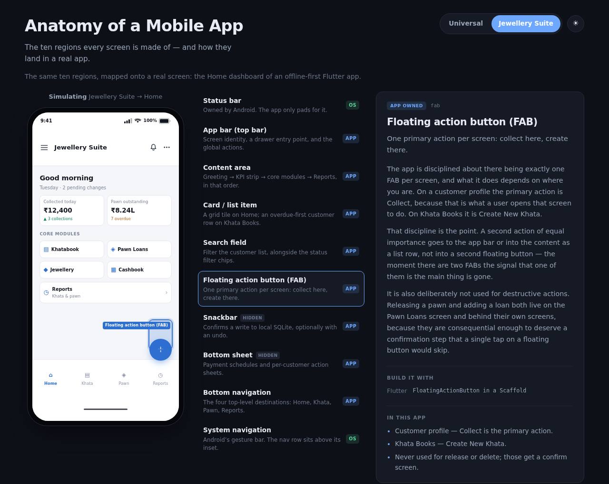

# Anatomy of a Mobile App

**The ten regions every screen is made of — and how they land in a real app.**

An interactive explainer. There is a phone on the left; you click a part of it —
the status bar, the app bar, a card, the floating button — and the panel on the
right explains what that part is for, who actually owns it, and how to build it.
A toggle swaps the whole thing between the *universal* anatomy and the same ten
regions mapped onto a real screen from a real app.



## Why this exists

Most people can build a screen that *works* and still cannot explain what is in
it. "It's just a list with a header" is a description of pixels, not of
structure. This project is an attempt to hand over a **vocabulary** — ten names
that are enough to describe almost any mobile screen — and then to show that the
same vocabulary describes *your* app, without renaming anything.

The idea of a clickable, annotated anatomy diagram is not mine. It comes from
[**AnatomyOf**](https://anatomyof.lunarwerx.com) by
[LunarWerx](https://lunarwerx.com) (MIT), which does this for source files and
programming languages. Everything here — the region model, all of the prose, the
simulation and this app — is original. If you like it, go read theirs; it covers
a lot more ground than one page.

## The ten regions

| Region | Owner | What it is for |
|---|---|---|
| **Status bar** | OS | The strip the system reserves for time, signal and battery. Never draw your own. |
| **App bar (top bar)** | App | Screen identity: the title on the leading/centre side, actions on the trailing edge. |
| **Content area** | App | The scrollable region holding whatever the screen is actually for. Usually the only thing that scrolls. |
| **Card / list item** | App | The tappable unit that repeats down the content area. One row, one thing, one tap. |
| **Search field** | App | Narrows a large set to a small one. Placeholder text names the thing being searched. |
| **Floating action button** | App | The one prominent action for the whole screen. Singular by design. |
| **Snackbar** | App | Brief confirmation, optionally with an undo. Queued, never stacked. |
| **Bottom sheet** | App | A temporary, contextual panel for choices that belong to this moment only. |
| **Bottom navigation** | App | The persistent bar of 3–5 top-level destinations. |
| **System navigation** | OS | The gesture pill or button row the platform keeps for leaving your app. |

### The one distinction that matters most

Every region is tagged **`OS`** or **`App`**, and the two OS regions are the ones
people get wrong. The status bar and the system navigation bar are painted by
the platform — your app is told how tall they are and is expected to pad by
exactly that much. Draw a status bar yourself and the system paints over it.
Ignore the insets and your bottom navigation ends up underneath the gesture pill
on the one device that made your content longest.

## The two datasets

**Universal** — the ten regions described on their own terms, for any app on any
platform. This is the vocabulary.

**Jewellery Suite** — the same ten region ids, re-described against a real
screen: the Home dashboard of [Jewellery Suite](https://github.com/ShyberDev/Jew_Pawn-Lending-Suite),
the offline-first Flutter client for the Jewellery + Pawn + Khatabook + Lending
bundle. Same region, same id, same position on screen — different copy, and a
`In this app` section naming the actual screens and the actual constraints.

That is the whole argument of the project: the vocabulary transfers. Once you
can name the ten regions on a generic screen, you can name them on your own app,
and reviewing a screen becomes a conversation about structure rather than about
pixels.

## Running it

Requires Node 18+.

```bash
npm install
npm run dev        # http://localhost:5173
npm run build      # type-check + production build into dist/
npm run preview    # serve the production build
```

Deploying is `dist/` on any static host. There is no backend, no account and no
build-time data fetching, so GitHub Pages, Netlify and Cloudflare Pages all work
by pointing at the output directory.

## How it's put together

The simulation is not hand-drawn. Each region carries its own geometry as
fractions of the phone screen, and the component draws a transparent hit area per
region on top of a CSS mock. There are no coordinates in the template.

```
src/
├── data/
│   ├── types.ts        the Region model — the only file that defines the shape
│   ├── universal.ts    the ten regions, generic
│   └── jewellery.ts    the same ten ids, mapped onto a real app
├── components/
│   ├── PhoneFrame.vue  the mock screen + the hit areas
│   ├── RegionList.vue  the legend, which doubles as the control for overlays
│   └── DetailPanel.vue the explanation
└── App.vue             dataset switching and selection state
```

Z-ordering is explicit in `PhoneFrame.vue`. The content area's children have to
out-rank their own parent, and overlays have to out-rank everything, or the
largest invisible rectangle on the screen quietly swallows every tap.

### Adding a dataset

Add one file under `src/data/` exporting a `Dataset`, then add it to the
`datasets` array in `App.vue`. The simulation reads its geometry from the data,
so a new dataset needs no component changes and the phone does not move a pixel.

Two behaviours worth knowing:

- **Overlays start hidden.** A snackbar and a bottom sheet are not part of a
  resting screen, so they only appear when you select them — from the phone or
  from the legend, which shows a `hidden` / `shown` badge to say so. A FAB is
  always on, because it is part of the baseline.
- **Selecting something already selected deselects it**, so clicking a region
  twice returns you to the empty panel.

## Credits

- Interaction pattern inspired by [**AnatomyOf**](https://anatomyof.lunarwerx.com)
  by [LunarWerx](https://lunarwerx.com) — MIT licensed. Not affiliated.
- The app documented in the second dataset is
  [Jew_Pawn-Lending-Suite](https://github.com/ShyberDev/Jew_Pawn-Lending-Suite)
  by [ShyberDev](https://github.com/ShyberDev).

## License

MIT © ShyamSai. See [LICENSE](LICENSE).
